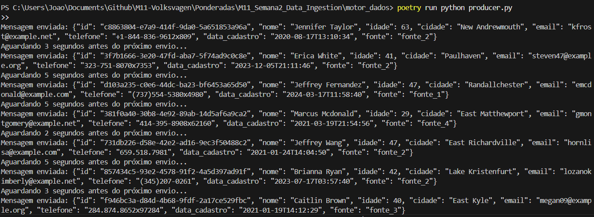
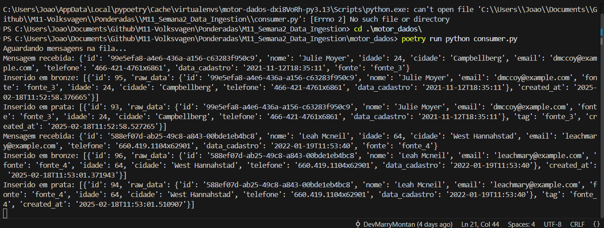
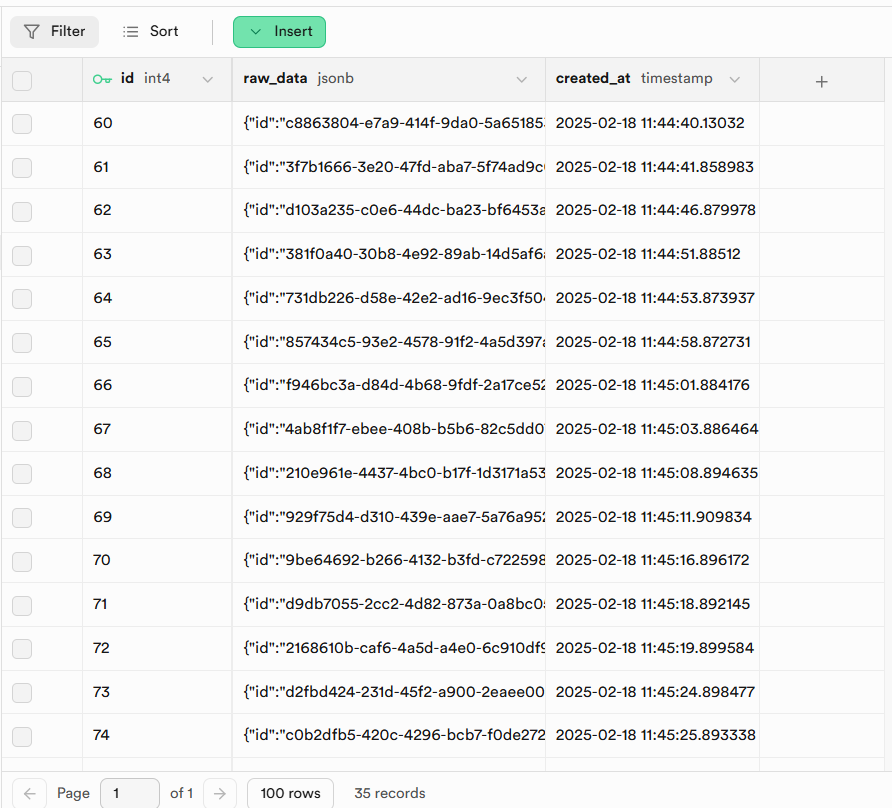
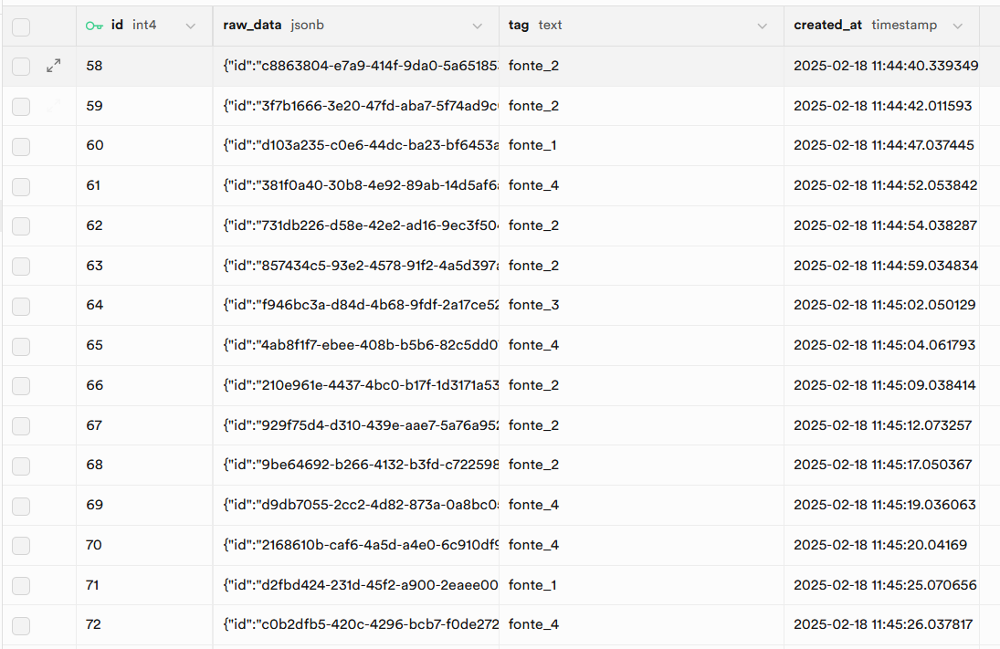

# Data Ingestion com RabbitMQ e Supabase

Este projeto implementa um pipeline simples de ingestão de dados utilizando RabbitMQ para mensageria e Supabase para armazenamento. O fluxo funciona assim:

1. O **Producer** gera e envia dados aleatórios para a fila RabbitMQ.
2. O **Consumer** consome os dados e os insere em duas camadas no Supabase:
   - **Camada Bronze**: Armazena o dado bruto como foi recebido.
   - **Camada Prata**: Armazena o dado com uma **tag** indicando a fonte de origem.

Os dados são gerados com a biblioteca Faker para facilitar a simulação de entradas realistas.

## Como Rodar

### Instalar as Dependências
```sh
poetry install
```

### Iniciar o RabbitMQ (se estiver no Docker)
```sh
docker start rabbitmq
```

Se não estiver configurado, rode:
```sh
docker run -d --name rabbitmq -p 5672:5672 -p 15672:15672 rabbitmq:3-management
```

### Rodar o Producer
```sh
poetry run python producer.py
```

### Rodar o Consumer
```sh
poetry run python consumer.py
```

## Prints

### RabbitMQ
Producer

Consumer


### Supabase
Bronze

Prata



